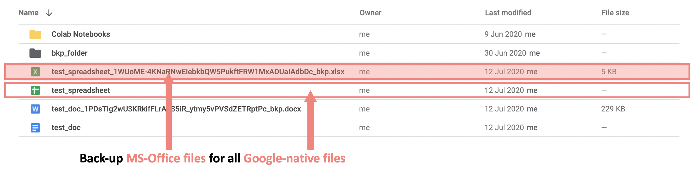

# google-file-exporter

**Export and backup Google-native files to Microsoft Office file-types to allow 
local device storage and backup.**

It's annoying that we cannot store and backup Google-native docs, sheets and 
slides as files on your local computer. We export these files into MS-Office 
files and store them in their original Google Drive folder. This way they can
be synced to the local device and be part of normal back-ups like any other 
file.

## Getting started

- Get credentials for desktop app via quickstart https://developers.google.com/drive/api/v3/quickstart/python
- Make sure `token.pickle` from previous session is deleted
- Insert id for the `ORPHANS_FOLDER_ID` constant (see below)
- Run `main.py`. Calling `src.auth.credentials_func`, it will initate the google authentication process in the browser
- Once authorized successfully, a new `token.pickle` file will be stored into the project directory
- `main.py` should then run a backup
- "Orphan" files lacking a parent folder id, e.g. files the user has been shared by others, will be stored here

### Orphan files lacking parent folder id

There are files lacking a parent folder id. We nicknamed them "orphans". 
These are files shared with the user by others. For storing their backup files 
in GoogleDrive, choose a folder. Copy the folder's id into the respective 
constant `ORPHANS_FOLDER_ID` in `main.py`, and files will be stored here. Find 
the folder id by navigating to the folder in the webbrowser and copying it from 
the URL. 

## TODO

- [x] Refactor `run_update`function
- [x] Check unused libraries
- [x] clean up dependencies, create `requirements.txt`
- [x] Use pathlib and make paths constants
- [x] Feature to delete existing older file bkps from google drive
- [x] Remove keeping a pickle bkp file for each run-iteration
- [x] Fix issue with old-bkp-file-trashing, when that file has been deleted
- [ ] Add unittests (pytest)
- [x] Check update functionality 
- [ ] Improve docstrings
- [ ] Reduce, improve print logs
- [ ] Create pip package
- [ ] Use Github Actions for scheduled backups
- [ ] Implement full CI/CD

